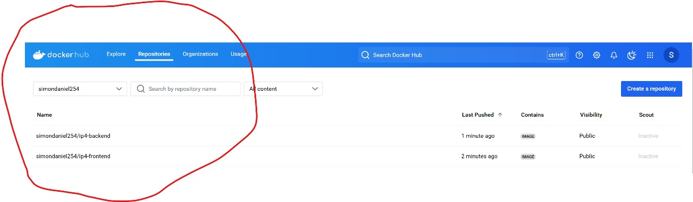

# Overview
This project involved the orchestration of a containerized application using Google Kubernetes Engine (GKE).
The application consists of two services:

### • Frontend: simondaniel254/ip4-frontend:v1.0.0

### • Backend: simondaniel254/ip4-backend:v1.0.0

The backend communicates with a MongoDB cluster (configured within the backend image). The deployment uses Kubernetes objects such as Deployments, Services, Persistent Volumes to ensure scalability, availability, and reliability.

# Architecture

### • Frontend: Exposed to the internet via a Kubernetes LoadBalancer service.

### • Backend: Exposed internally to the frontend via a ClusterIP service.

### • Database: Hosted on an external MongoDB cluster.

# Requirements
• Have a Google Cloud Account.
• Kubernetes CLI (kubectl) is installed on your Local Machine
• Install Google cloud CLI to interact with the cloud directly from local development.
- [gcloud CLI](https://cloud.google.com/sdk/docs/install#deb) 
• Have the application containerized and pushed to docker hub as shown below:

# Deployment Instructions

## Clone this repository:

• git clone https://github.com/danielsimon254/IP4
• cd <repository-folder>

## Apply the Kubernetes manifests in the following order:

• kubectl apply -f backend-deployment.yaml
• kubectl apply -f frontend-deployment.yaml

## Verify that the pods are running:

• kubectl get pods

## Get the external IP of the frontend service:

• kubectl get svc frontend-service

## Access the application in your browser using the external IP.

# LIVE Application
    • Visit the external IP of the frontend service in your browser.
    
     [Live URL] (http://34.38.147.47:80)

# Repository Structure

• backend-deployment.yaml: Deployment manifest for the backend.

• frontend-deployment.yaml: Deployment manifest for the frontend.

• README.md: This file.

• explanation.md: Detailed explanation of implementation choices.